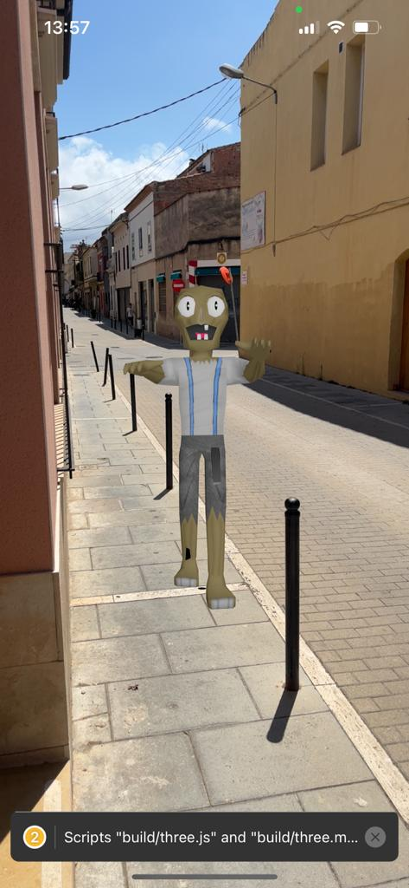
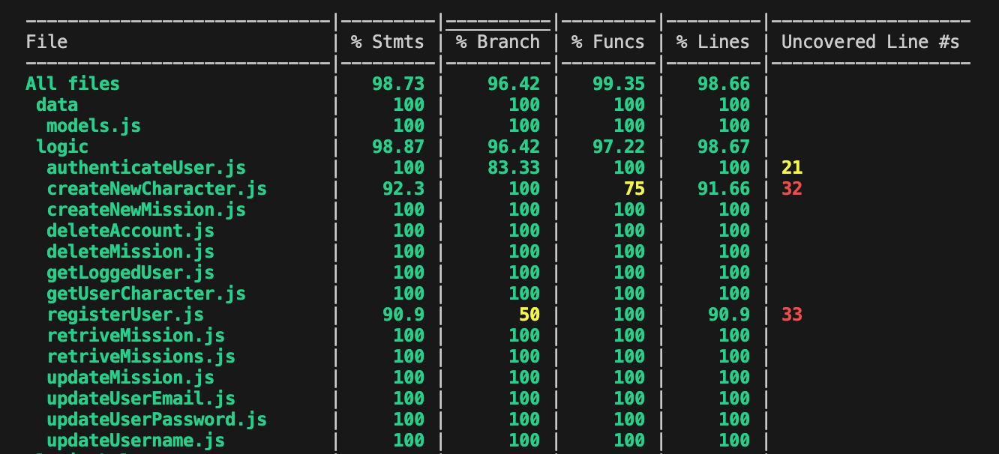

# Infected Reality
#### ISDI CODERS FINAL PROJECT
#### Author: Arnau Ciriquian

## Introduction

Infected Reality is an immersive AR game that revolves around completing missions to survive a zombie-infested world. Players must locate caches or exit points in specific coordinates and navigate there in their actual surroundings, utilizing augmented reality. As they progress, zombies will appear on the phone's camera feed, requiring players to eliminate them to stay alive.

## Functional description
### Use cases
- Create a survivor
- Play missions
- Earn rewards
- Update user info
- Check user/survivor statistics

## Technical descrition
User
- id (string)
- name (string)
- email (string)
- password (string)
- avatar (string) 

Survivor
- id (string)
- user (string, refers to User id)
- name (string)
- image (string)
- missions played (number)
- missions completed (number)
- missions failed (number)
- zombies killed (number)

Mission
- id (string)
- survivor (string, refers to Survivor id)
- type (string)
- time (string)
- pass (boolean)
- fail (boolean)
- zombies killed (number)

### Planning
Notion: https://congruous-beetle-52e.notion.site/Infected-Reality-ISDI-Final-Project-de0f109cf97b42d589f8e94bf03b223d?pvs=4

### Design
Figma: 

### Testing
