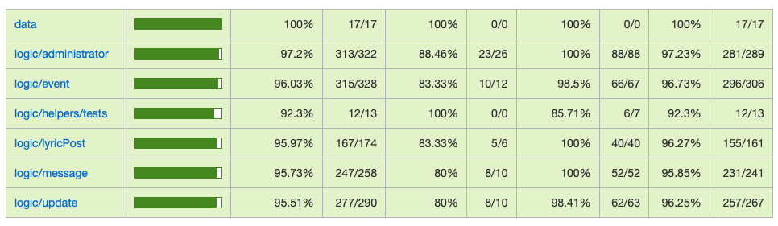

# Alex Maybe Web

## Intro

This webapp is the official web for Alex MayBe, an andalusian musician. It provides all the information that their fans need, including events information (dates, location, etc...), updates, lyrics posts, contact and social network integration. It also provides a section to manage all events, updates, lyrics posts and messages from the contact section, accessible only to him (and/or someone who he authorizes).

It uses React, Tailwind CSS, HeadlessUI, NextJS, MongoDB and Mongoose. API written in JavaScript, App written in TypeScript.

## Functional description

### Use cases

- add administrator
- authenticate administrator
- modify administrator credentials
- delete administrator

- see events list
- add event
- modify event
- remove event

- see updates list
- add update
- modify update
- remove update

- see lyrics list
- add lyric post
- modify lyric post
- delete lyric post

- see messages list
- read message
- delete message

- see update
- see event
- see lyric post
- create message

## Technical description

### Data model

Administrator
- id (oid)
- name (string)
- email (string)
- password (string)

Update
- id (string)
- author (oid, refers to Administrator id)
- title (string)
- image (string)
- text (string)
- rss message text (string)
- date (date)
- visibility (boolean)

Event
- id(string)
- author (oid, refers to Administrator id)
- title (string)
- date (date)
- location (string)
- text (string)
- links (array of links)
- visibility (boolean)

Lyric Post
- id (string)
- author (oid, refers to Administrator id)
- title (string)
- media link (array of string)
- text (string)
- song info (string)
- date (date)
- visibility (boolean)

Message
- id (string)
- author (user email)
- title (string)
- text (string)
- date (date)
- status (boolean)

Users Data
- users mail (array of users mail)

Social Networks
- id (string)
- name (string)
- link (string)

### Test Coverage

## Design
Design will be managed with Figma: https://www.figma.com/file/M8POaubUvK4RN7R1Xidmv6/AMW?type=design&node-id=0%3A1&mode=design&t=qOYEB5PC6ZbirbBk-1
## Planning
Planning will be managed with Trello: https://trello.com/invite/b/Sw9wR2tM/ATTIa767f6a0e5966b75f726de8b3eedf89740CE1060/amw

### Epics & Stories

#### Add Administrator

- Me as an administrator, I want to add another administrator

##### Tasks

- Set up MongoDB
- Initiate core API functionality
- Create Mongoose model
- Set up Mongoose
- Create an administrator manually
- Implement add administrator

#### Authenticate Administrator

- Me as an administrator, I want to add authenticate myself in the system

##### Tasks

- Create tokenizer and encryption
- Implement authenticate administrator
- Modify add administrator so it requires authentication

#### Modify Administrator Credentials

- Me ad an administrator, I want to modify my credentials.

##### Task

- Implement modify credentials

#### Delete Administrator

- Me as an administrator, I want to delete an administrator account

##### Task

- Implement delete administrator

#### See Event List

- Me as an administrator, I want to see the event list
- Me as a user, I want to see the event list

##### Task

- Implement event listing

#### Add Event

- Me as an administrator, I want to create an event

###### Task

- Implement add event

#### Modify Event

- Me as an administrator, I want to modify an event information

##### Task

- Implement modify event

#### Delete Event

- Me as an adminitrator, I want to delete an event

##### Task

- Implement delete event

#### See Updates List

- Me as an administrator, I want to see the updates list
- Me as a user, I want to see the updates list

##### Task

- Implement updates listing

#### Add Update

- Me as an administrator, I want to create an update and push it to RSS if it's visible

###### Task

- Implement add update

#### Modify Update

- Me as an administrator, I want to modify an update information

##### Task

- Implement modify update

#### Delete Update

- Me as an adminitrator, I want to delete an update

##### Task

- Implement delete update

#### See Lyrics List

- Me as an administrator, I want to see the lyrics list
- Me as a user, I want to see the lyrics list

##### Task

- Implement lyrics listing

#### Add Lyric Post

- Me as an administrator, I want to create an lyric post

###### Task

- Implement add lyric post

#### Modify Lyric Post

- Me as an administrator, I want to modify a lyric post

##### Task

- Implement modify lyric post

#### Delete Lyric Post

- Me as an administrator, I want to delete a lyric post

##### Task

- Implement delete lyric post

#### See Message List

- Me as an administrator, I want to see the messages list

##### Task

- Implement messages listing

#### Read Message

- Me as an administrator, I want to read a message

###### Task

- Implement read message

#### Delete Message

- Me as an administrator, I want to delete a message

##### Task

- Implement delete message

#### Create Message

- Me as a user, I want to create a message

##### Task

- Implement create message

#### See Event

- Me as a user, I want to see an event

##### Task

- Implement see event

#### See Update

- Me as a user, I want to see an update

##### Task

- Implement see update

#### See Lyric Post

- Me as a user, I want to see a lyric post

##### Task

- Implement see lyric post