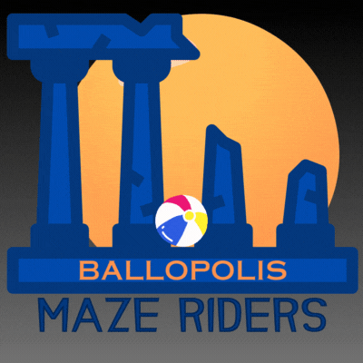

# Ballopolis Maze Riders




# Intro
This is a web app build as the final project for the ISDI Coders' online web development fullstack bootcamp.
</br>
</br>
Ballopolis is meant to be a social game, where you create levels that are fun and challenging to beat for other players.
</br>
</br>
In doing so, you earn achivements to add to your profile and show off to your friends and other users.
</br>
</br>
To create those levels you need to earn Customization Credits by playing other people levels.
</br>
</br>
So YOU play levels to earn points to create levels that other people will play to earn points to create levels that YOU will play!
</br>
And that's the loop in which this game lives...
</br>
</br>

# Functional description

## Use cases

- create level
- edit level
- play level
- earn achivements
- toggle like level
- see other users achivements
- see other users created levels
</br>
</br>

# Technical description

## Technologies & Libraries

- React
- Vite
- Three JS
- Tailwind
- React-Lottie
- Bootstrap-icons
- Node
- Express
- MongoDB and Mongoose
- Mocha Chai *for backend testing*
</br>
</br>


## Data model

Level
- id (uuid)
- name (string)
- layout (matrix of strings)
</br>
</br>

## Test Coverage

</br>

File                 | % Stmts | % Branch | % Funcs | % Lines | Uncovered Line #s 
---------------------|---------|----------|---------|---------|-------------------
*logic / levels*         |   *96.29* |       *50* |     *100* |     *100* | 
  createLevel.js     |     100 |      100 |     100 |     100 | 
  retrieveLevel.js   |      90 |       50 |     100 |     100 | 15                
  retrieveLevels.js  |     100 |      100 |     100 |     100 | 
</br>

# Planning

Planned through a kanban visible on this [Trello](https://trello.com/b/uHRmZKBR/final-project-ballopolis).
</br>
</br>

## Epics & Stories

### **Demo page**

- Me as a user, I want to see a basic page where i can try the main functionalities and learn about the app

#### Tasks

- [ ] Build landing page
- [x] Build levels list page
- [x] Build on game page
- [x] Build create level page
- [ ] Build about page
- [ ] Build tutorials for the game
- [x] Implement create level functionality
- [x] Implement retrieve all levels functionality
- [x] Implement retrieve one level functionality
- [x] Use TDD to add validators
- [x] Improve error handling
- [ ] Improve GameOver modal style
- [ ] Improve UX of the create level form
- [x] Upload the page to AWS

</br>
</br>

# Project setup
## App
[Click here >>](../app/README.md)

## Api
[Click here >>](../api/README.md)

## Com
[Click here >>](../com/README.md)

</br>
</br>

# Project AWS Update

Github, through github actions, updates the image on push. It's automatic, but could fail. So always check for errors first.

Go to EC2, connect to the machine. Check the ip of the instance and keep it update, then run:
```sh
$ docker-compose down # only if it was already running
$ sudo docker system prune -a # to clean local cache
$ sudo docker-compose up -d # run services on deamon mode
```

To know more about how this project was deployed on AWS [click here!](./awsconfig.md)

