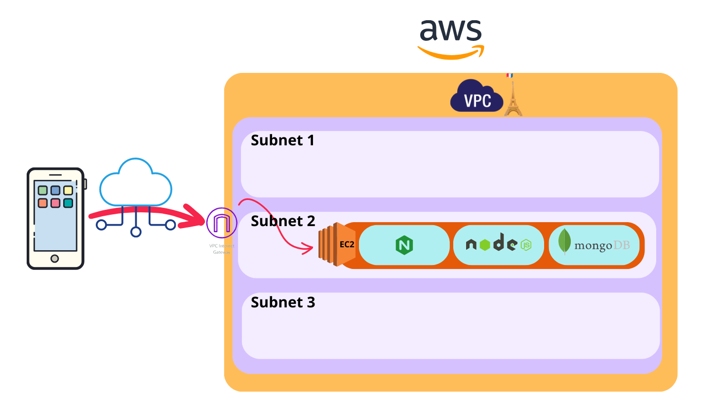

# How to configure and run the app on aws

## 1. Register
- enter [here](signin.aws.amazon.com) and follow the steps.

## 2. Control your budget (optional)

- Look for billing on the search bar, then go to cost management/budgets.

- Fix the budget to your economy. Mine is 0 :D

## 3. Create EC2 instance and connect to it

- As a recomendation, run t2.micro for free and give permision to http, https and ssh.

## 4. Install docker with yum
```sh
$ sudo yum install docker
```

## 5. Create github action to have a pipeline

- With this, when doing a push I will be creating images of my project to run on my EC2 instance.

### Register to dockerhub

- Access [here](https://hub.docker.com/).

### Create repository github secret
- As explained [here](https://github.com/docker/login-action#docker-hub).

### Configure github action for build and push
- As explained [here](https://github.com/docker/build-push-action).
- *All* my configuration files are:
    - [flors-rueda-ci-cd.yml](../../../../../.github/workflows/flors-rueda-ci-cd.yml).
    - [Dockerfile for the backend](../Dockerfile)
    - [docker-compose.yml](../docker-compose.yml)
    - [nginx configuration](../nginx/nginx.conf)
    - [Dockerfile for the front](../nginx/Dockerfile)

- With nginx I connect front and back on the same IP, avoiding cors security errors or browser issues.

### Go back to EC2 to create and connect frontend to backend to mongo (all being containers)

- Install docker-compose following [these](https://stackoverflow.com/questions/36685980/why-is-docker-installed-but-not-docker-compose) if there's any problem.

- Write docker-compose on EC2

```sh
vim docker-compose.yml
```
- Press **i** to write, **v** to select and **d** to delete.

- With right click paste this [docker-compose.yml](../docker-compose.yml) and press ESC and **:wq**.

```sh
$ sudo docker-compose up -d
```
```sh
$ sudo docker ps # shows the containers running
```

```sh
$ curl -v localhost:80/api # test hello api
```
```sh
$ curl -v -X POST localhost:80/api/levels -H "Content-Type: application/json" -d '{"name": "curlTest", "layout": [["empty", "bomb", "stonks", "empty", "dirt", "bomb", "dirt", "empty", "start"]], "id": "id-ex1"}'  # test post to api
```
## Acces the ip to check if the front is running, everything should be fine!



