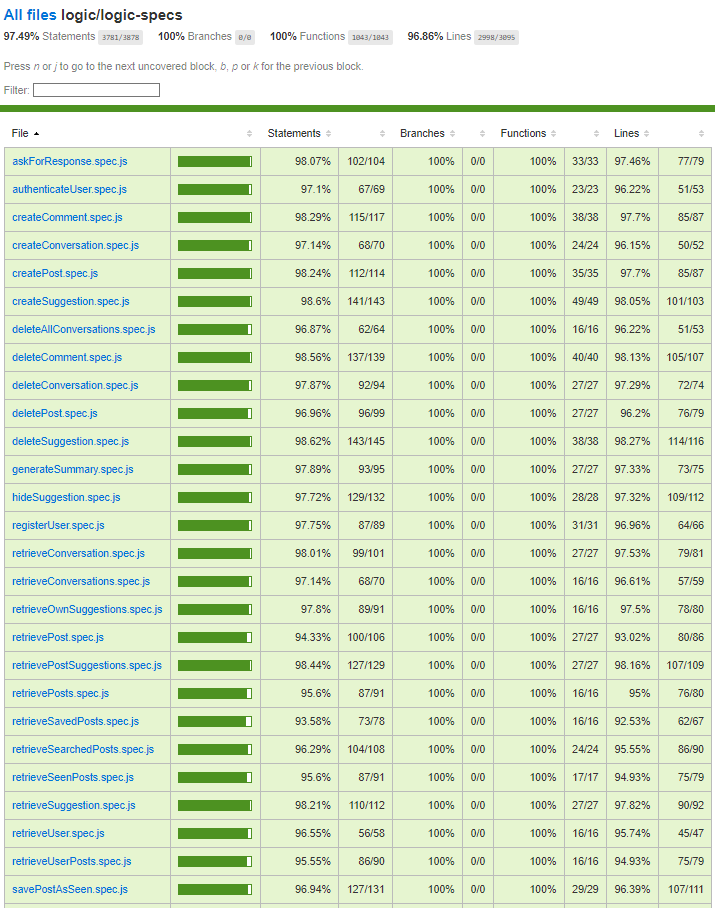
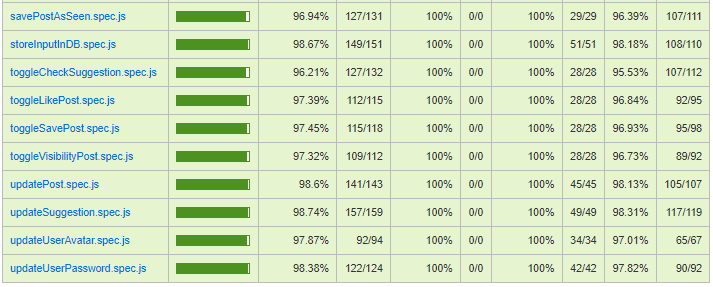

# App

## Intro

This application is a social network that allows users to share text content on various topics. Additionally, it features a chatbot function where users can interact with an AI to ask questions related to those topics. The text shared on the platform consists of summaries generated by the AI based on the previous user conversation. If a user finds that the generated text needs adjustments, they can easily edit and customize it to their liking.

Among its other functionalities, users can comment on posts by other users, like and save posts, provide suggestions for improvements or report errors in the posted content. Users can also search for posts based on the its title content. Furthermore, the application allows users to conveniently access and view the last 15 posts they visited.

### Fuctional description

### Use cases
- Start conversation / interact with chatbot (ask questions, request summarys)
- Delete conversation
- Delete all conversations
- Generate / publish post (with summary)
- Search post
- Click on post to open post modal with all the post information
- Modify own post's title or conetnt
- Delete own posts
- Toggle like post
- Toggle fav/save post
- Create post comment
- Delete post comment
- Create post suggestion
- Modify post suggestion's title or content (by the suggestion owner)
- Delete post suggestion (by the suggestion owner)
- Set suggestion as checked (by the post owner)
- View all posts in home page
- View own posts
- View saved posts
- View last fifteen seen posts
- View user made suggestions
- View comment section in post
- View suggestion section in post
- Update user avatar
- Update user password

### Data model

User
- id (oid)
- name (string)
- email (string)
- password (string)
- avatar (string)
- favs (oid array, refers to Post id)
- seenLately (oid array, refers to Post id)

Post
- id (string)
- author (oid, refers to User id)
- title (string)
- text (string)
- date (object)
- likes (oid array, refers to User id)
- visible (boolean)
- comments (array with comments)

Comment
- id (oid)
- author (string)
- auhotrId (oid)
- text (string)

Suggestion
- id (oid)
- author (oid, refers to the User id)
- post (oid, refers to the Post id)
- postAuthor (oid, refers to the id of the author of the post)
- title (string)
- content (string)
- checked (boolean)
- hidden (boolean)

Conversation
- id (oid)
- author (oid, refers to User id)
- title (string)
- messages (array of messages from a conversation)

Message
- id (oid)
- role (string)
- content (string)

### Test Coverage

## Planning

### Epics & Stories

#### Access control

- Me as a user, I want to register my credentials and acces with them to the App

##### Tasks

- build html
- build basic css
- implement register functionality
- implement login functionality
- implement home welcome functionality

#### Start conversation, create posts, and refresh posts list

- Me as user, I want to talk with the chatbot to ask some questions
- Me as user, I want ask the chatbot to generate a summary about some topics
- Me as user, I want to 

##### Tasks

- implement a chat bot window to interact with it
- implement an 'ask me' button to talk to the chat bot
- implement a 'generate summary' button to make a summary
- implement prompt logic to generate responses and summaries (input: text)
- implement a 'create post' button to create a post with the generated summary
- implement a 'copy' button to copy the generated response
- implement logic to persist the info (post with summary) in database 
- implement retrievePosts logic to get all posts form database
- implement a panel for listing posts in home

#### Edit a post and refresh list

- Me as user, I want to have the edit option (as a button) in every post I created, open the Edit dialog with it, and save the changes in the post
- Me as user, I want to edit the comment section, to delte any comment if there are any inappropiate one
- Me as user, I want to see the list of updated posts with the changes applied in any of my posts

##### Tasks

- implement an 'edit' button to edit an existing post in all the posts that belong to the use connected (in the session)
- implement a 'delete comment' comment button to remove inappropiate comments in the posts that belong to the user connected()
- implement the modal window to edit the post
- implement logic to save in database the changes made to the post and its comment section
- add a call to refresh the posts list after saving the changes in the edited post

#### Delete a post and refresh list

- Me as a user, I want have a delete option (as a button) in any post I create, open a Delete dialog with it, and preceed to delete the post if accepted (or cancel it otherwise)
- Me as user, I want to see the list of summaries updated with the changes applied in any of my posts

##### Tasks

- implement a 'delete' button in any of the posts of the conencted user (in the session)
- implement deletePost logic to remove post from database
- implement a modal window to ask the user if he/she really want to deletethe post (two buttons: delete, cancel)
- add a call to refresh the posts list after deleting one post

#### Generate an improvement suggestion and refresh list

-Me as a user, I want to have the option to generate improvement suggestions (as a button) in every summary in the feed, open a dialog with it, and proceed to make the suggestion

##### Tasks

- implement an 'add suggestion' button to each post that does not belong to the user connected (in session)
- implement modal window to write the suggestion (form with two text inputs: title (reason of the suggestion) and content (description of the suggestion))
- implement generateSuggestion logic to save suggestion in database
- add call to refresh posts list with the new suggestions

#### Delete suggestion and refresh list

- Me as user, delete a suggestion made by me.

##### Tasks

- implement 'delete button' in every suggestion made by me
- implement deleteSuggestion logic to remove suggestion from database
- add call to refresh the posts list wiht the updated changes

#### Watch made suggestions, remove the checked ones in own posts and refresh list

- Me as user, I want to see the suggestions made in all posts to see if the contribution i want to make is already done.
- Me as user, I want to remove the suggestions made in my posts once checked.

##### Tasks

- implement 'suggestions' button in each post that does not belong to the connected user (in session) to open a window with all the suggestions made.
- implement logic to retrieve all the suggestions made in one post
- implement logic to remove the suggestions cheched by user in his/her posts
- add call to refresh the posts with the made changes